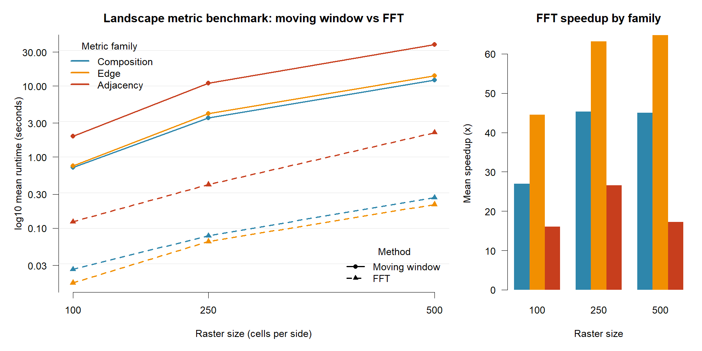

# Landscape Metric Benchmark

Benchmark configuration:
- 10 independent categorical rasters per size
- Raster sizes: 100x100, 250x250, 500x500
- 4 land-cover classes
- Circular moving window radius: 3 cells
- Methods compared: conventional moving window (`terra::focal`) vs multiScaleR FFT whole-raster implementation

## Family-level summary

| Size | Family | Moving Mean (s) | FFT Mean (s) | Speedup (x) |
| --- | --- | --- | --- | --- |
| 100 | Composition | 0.711 | 0.026 | 26.9 |
| 100 | Edge | 0.756 | 0.017 | 44.5 |
| 100 | Adjacency | 1.974 | 0.123 | 16.0 |
| 250 | Composition | 3.547 | 0.078 | 45.3 |
| 250 | Edge | 4.107 | 0.065 | 63.2 |
| 250 | Adjacency | 10.927 | 0.410 | 26.6 |
| 500 | Composition | 12.115 | 0.269 | 45.0 |
| 500 | Edge | 13.951 | 0.215 | 64.8 |
| 500 | Adjacency | 38.233 | 2.213 | 17.3 |

## Selected 500x500 metrics

| Metric | Moving Mean (s) | FFT Mean (s) | Speedup (x) |
| --- | --- | --- | --- |
| shdi | 11.992 | 0.285 | 42.1 |
| ed | 13.440 | 0.214 | 62.8 |
| te | 14.036 | 0.200 | 70.2 |
| pladj | 39.365 | 0.535 | 73.6 |
| contag | 37.102 | 3.892 | 9.5 |

## Figure

